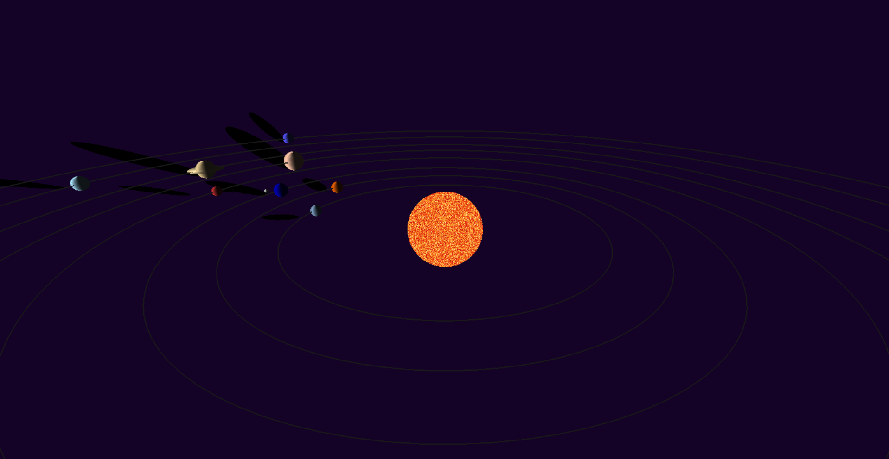
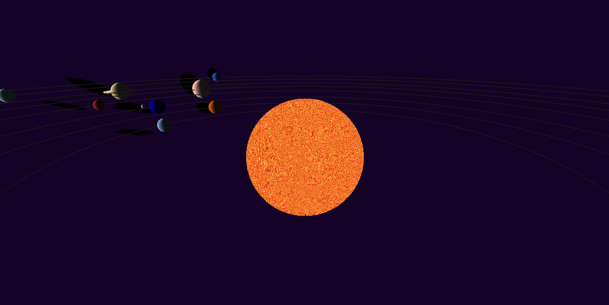

# OpenGL Solar System 🌍🌞

A 3D simulation of the Solar System built with C++ and OpenGL, featuring realistic planetary orbits, lighting, shadows, and textures.

## Features
- **3D Planetary System**: Each planet is modeled as a sphere with realistic proportions.
- **Textured Sun**: The Sun has a texture to enhance realism.
- **Dynamic Lighting**: Simulates light interaction between the Sun and planets.
- **Shadow Projection**: Generates shadows for depth and realism.
- **Orbital Paths**: Displays the orbits of planets for better visualization.
- **User Interaction**: Navigate and control the view with keyboard inputs.

## Controls
- **Arrow Keys**: Rotate the camera.
- **`+` / `-`**: Zoom in and out.
- **`l` / `r`**: Adjust light position.

## Screenshots

